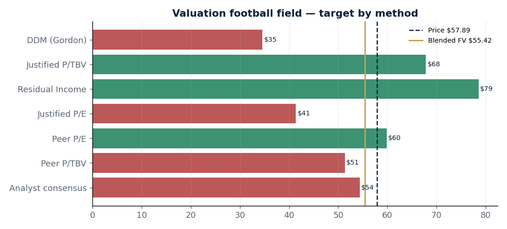

# Fifth Third Bancorp (NASDAQ: FITB) — Institutional Equity Research Engine

A single-file, reproducible Python project that produces a **hedge-fund / investment-bank style
fundamental analysis and valuation** of Fifth Third Bancorp, then renders it as a polished HTML
research note and emails it. Built as a portfolio project to show end-to-end equity-research
skills: data engineering → bank-specific analysis → multi-model valuation → automated reporting.

> ⚠️ Educational portfolio project. **Not investment advice.**



---

## Why Fifth Third is an interesting case study

In October 2025 Fifth Third agreed to acquire **Comerica** in a ~$12.7B all-stock deal that closed
**1 Feb 2026**, creating the **9th-largest U.S. bank** (~$288B assets). The first post-merger quarter
(Q1-2026) printed a headline EPS of just **$0.15** — crushed by **$635M** of one-off merger charges —
even as underlying revenue grew 33% YoY. That gap between *reported* and *normalized* earnings is
exactly the kind of situation a fundamental analyst is paid to see through. This project builds the
framework to do that.

## What it does

1. **Live data** — pulls price, shares, EPS, dividend, beta and multiples for FITB and a
   super-regional peer set (KEY, HBAN, RF, CFG, MTB, PNC, USB) via `yfinance`, with embedded
   fallbacks so it runs offline.
2. **Curated fundamentals** — a documented snapshot from FITB's FY2025 results and Q1-2026 earnings
   release (segments, ROTCE, efficiency ratio, CET1, NIM, credit quality, 2026 guidance, deal terms).
3. **Six valuation methods, blended:**
   | Method | Idea |
   |---|---|
   | Dividend Discount (Gordon) | value of the dividend stream |
   | **Justified P/TBV = (ROTCE − g)/(COE − g)** | the core bank identity — premium to tangible book only if it out-earns its cost of equity |
   | Residual Income (Excess Returns) | book value + PV of returns above cost of equity |
   | Justified P/E = payout·(1+g)/(COE − g) | fundamentals-implied earnings multiple |
   | Peer relative | peer-median P/E and P/TBV applied to FITB |
   | Analyst consensus | market cross-check |
4. **Analyst frameworks** — a **CAMELS** scorecard (Capital, Asset quality, Management, Earnings,
   Liquidity, Sensitivity), a bank **DuPont** decomposition (ROA × leverage = ROTCE), and
   **bull / base / bear scenario** analysis.
5. **Reporting** — generates four charts + a self-contained HTML note and emails it with inline images.

## Sample output (live run)

```
Price $57.89 | beta 0.92 | P/E 19.5 | P/B 1.64
Cost of equity (CAPM): 8.81%
   DDM (Gordon)         $34.59   (-40.2%)
   Justified P/TBV      $67.82   (+17.1%)
   Residual Income      $78.57   (+35.7%)
   Justified P/E        $41.38   (-28.5%)
   Peer P/E             $59.86   (+3.4%)
   Peer P/TBV           $51.34   (-11.3%)
   Analyst consensus    $54.38   (-6.1%)
   BLENDED FAIR VALUE   $55.42   (-4.3%)   →  HOLD
```

The wide dispersion is deliberate and honest: DDM/justified-P/E understate value for a bank that
*retains* most of its earnings, while residual-income and P/TBV capture that retained-earnings
compounding. A disciplined analyst shows the range rather than cherry-picking one number.

## Project modules (run in this order)

| Module | What it produces |
|---|---|
| `fitb_analysis.py` | Core fundamental note + **6-method intrinsic valuation** (DDM, justified P/TBV, residual income, justified P/E, peer relative, consensus) + CAMELS + DuPont |
| `consumer_deepdive.py` | Consumer & Small Business Banking deep dive — loan book by product, yields/finance charges, interchange & deposit fees, segment P&L, credit |
| `trend_analysis.py` | Multi-year (FY23→25) **horizontal, vertical/common-size, and rate/volume variance** analysis |
| `full_view_forecast.py` | Driver-based **earnings forecast (26–28E)** + forward-multiple 12-month price target (bull/base/bear) |
| `ib_deepdive.py` | **IB techniques:** trading comps, Comerica **accretion/dilution & TBV earnback**, sum-of-the-parts, two-way sensitivity |
| `master_report.py` | **Capstone** — consolidates all of the above + adds P/TBV~ROTCE regression, reverse-DCF (implied growth), and capital-return yield → weighted **14-method** target |

Each module builds an HTML note + charts into `output/` and can email it.

## Full methods catalog (what an IB desk uses)
Intrinsic: DDM (Gordon), justified P/TBV = (ROTCE−g)/(COE−g), residual income (excess returns), justified P/E ·
Relative: peer P/E, peer P/TBV, **P/TBV-vs-ROTCE regression (warranted multiple)** ·
Structural: sum-of-the-parts ·
Forecast: driver-based earnings build → forward P/E × NTM EPS, target P/TBV × TBVPS ·
Expectations: **reverse DCF (implied growth priced in)** ·
M&A: accretion/dilution & tangible-book earnback ·
Yield: total capital-return (dividend + buyback) ·
Frameworks: CAMELS, DuPont, horizontal / vertical (common-size) / rate-volume variance, CAPM cost of equity, bull/base/bear scenarios & two-way sensitivity.

## Optional: publish the writeup to LinkedIn (official API)
`DRAFT_linkedin_post.txt` is a ready-to-paste post. To publish it programmatically via
LinkedIn's **official** OAuth + Posts API (ToS-compliant), see `LINKEDIN_API_SETUP.md`
then:
```bash
python linkedin_post.py --auth                              # one-time OAuth
python linkedin_post.py --post DRAFT_linkedin_post.txt --dry-run
python linkedin_post.py --post DRAFT_linkedin_post.txt      # publish
```
Requires your own LinkedIn Developer app credentials (kept in a git-ignored `.env`).

## Quick start

```bash
pip install -r requirements.txt

python fitb_analysis.py --no-email          # build report + charts only
open output/FITB_report.html                # (Windows: start output\FITB_report.html)

python fitb_analysis.py --to you@email.com  # build and email the note
```

### Email setup (optional)
Set three environment variables (or a `.env` with the same keys):
```
EMAIL_USER=you@gmail.com
EMAIL_APP_PASSWORD=your_gmail_app_password
EMAIL_TO=recipient@email.com
```
Use a Gmail **App Password**, not your account password.

## Design notes / how to extend

- Every valuation input lives in the documented `ASSUMPTIONS` block — change one number and rerun.
- Swap `TICKER`/`PEERS` and the `FUND` snapshot to point the same engine at any other bank.
- The `residual_income()` and `justified_ptbv()` functions are the reusable core; the rest is plumbing.

## Key metrics referenced (FITB)

| Metric | Value | Period |
|---|---|---|
| Diluted EPS | $3.53 | FY2025 |
| ROTCE | 12.6% | FY2025 |
| Efficiency ratio | 56.9% | FY2025 |
| CET1 | 10.81% | FY2025 |
| NIM | 3.30% | Q1-2026 |
| Net charge-offs | 37 bps | Q1-2026 |
| 2026 NII guidance | $8.7–8.8B | mgmt |
| Cost-synergy target | $850M pre-tax | by Q4-2026 |

## Sources
FITB Investor Relations & SEC filings (FY2025 results, Q1-2026 earnings release, Comerica S-4);
market data via `yfinance`; sell-side consensus via public aggregators. See in-code citations.

---
*Built with Python. Data as of the run date. Not investment advice.*
